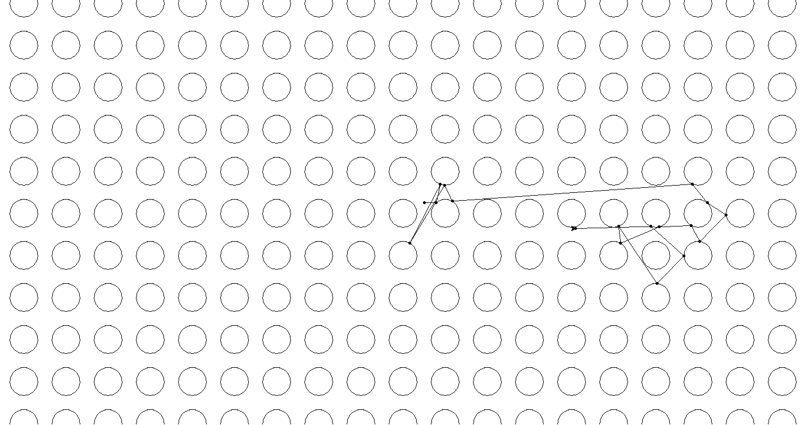

# Photon

## Introduction

A simple python script for simulating a photon moving through
2D space and reflecting off circular mirrors with integer center
coordinates and radius of `1/3`.

It was created as a project for the [DisCont mathematics 2](https://www.fer.unizg.hr/en/course/dismat2)
course at the Faculty of Electrical Engineering and Computing, University of Zagreb.

## Installation

Requires at least `python 3.6`.

```
pip install -r requirements.txt
```

## Usage

```
python photon.py
```

## Simulating a photon starting at `(0.5, 0.26)`

### Resulting Points

```
 0.500000000000000  0.260000000000000
 0.791406828704506  0.260000000000000
 0.886170271613143  0.686704765362629
 0.162337791730933 -0.708868496230595
 0.984960971593482  0.667006098050281
 1.167217449205239  0.288356438791307
 6.866225811762536  0.694687737435067
 7.223030282328772  0.247726874350482
 7.668755609754211 -0.037259428898021
 7.045625464852359 -0.669803955099221
 6.836903569092180 -0.290707181432179
 6.073913889728304 -0.325035148893690
 5.166352723084377 -0.711143837466597
 5.116816692422782 -0.312193804362791
 6.029650514360244 -1.667988015111978
 6.666874246414737 -1.011761947515690
 5.885223292792086 -0.312949546402643
 4.094556605959575 -0.360326614974185
```

### Resulting Image



## Related Projects

 * [PhotonReflection](https://github.com/LMesaric/PhotonReflection) by [@LMesaric](https://github.com/LMesaric)
